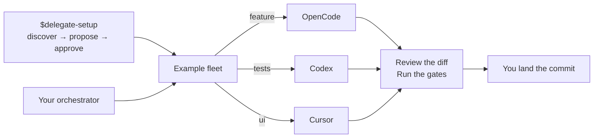

# delegate-skills

[](https://github.com/amElnagdy/delegate-skills/actions/workflows/relays.yml)
[](https://www.skills.sh/amElnagdy/delegate-skills)
[](LICENSE)

**Create your fleet of lanes. One orchestrator, the right implementer for every job.**

Discover the implementer CLIs already installed on your machine, organize them into lanes like
`feature`, `tests`, and `ui`, then delegate by lane — or choose one implementer directly. Either way,
you keep the review and the commit.

```bash
npx skills add amElnagdy/delegate-skills
```

Then ask your orchestrating agent to create the fleet:

```text
Use $delegate-setup to discover my installed implementer CLIs and create a fleet for feature, tests, and UI work.
```

Or delegate directly:

```text
Use $codex-delegate to have Codex implement the refactor in services/billing/, then review and commit it.
```



## Choose how you delegate

### Create a fleet

| Skill | Job |
| --- | --- |
| [`delegate-setup`](skills/delegate-setup/SKILL.md) | Discover installed CLIs, propose **fleet lanes**, and write global or project config after you approve. Never dispatches work. |

A **fleet** is your set of named lanes. Each **lane** binds a kind of work to one implementer and
optional dials such as model, effort, or variant. Setup discovers what is available, proposes a compact
fleet, shows you the complete configuration, and writes only after explicit approval.

Configuration can apply globally or to one repository. Once it is ready, dispatch with the matching
`*-delegate` skill and `--lane <name>`. Explicit flags override lane dials, and the wrong implementer
skill for a lane fails loud. Project config is content-bound to explicit setup approval, so cloned or
edited project lanes fail closed until re-approved. See the
[`delegate-fleet.v1` schema](skills/delegate-setup/references/schema.md) for paths, supported dials,
and overlay behavior.

### Delegate directly

Skip setup when you want one implementer or one-off dials. Pick the skill for a CLI you have:

| Skill | Implementer CLI | Write access (default) | Read-only run | Resume |
| --- | --- | --- | --- | --- |
| [`aider-delegate`](skills/aider-delegate/SKILL.md) | [Aider](https://aider.chat) (`aider`) — any OpenAI-compatible endpoint, including a local or self-hosted model via `--api-base` | `--yes-always` with `--no-suggest-shell-commands`; no sandbox or permission modes; commits force-disabled [^aider] | `--read-only` (`--dry-run`) | `--resume-last` (chat history, per-worktree) |
| [`agy-delegate`](skills/agy-delegate/SKILL.md) | Google Antigravity (`agy`) | Antigravity's own `permissions`; bypass opt-in | `--read-only` (`plan` mode) | `--resume-last`, `--conversation <id>` |
| [`claude-delegate`](skills/claude-delegate/SKILL.md) | [Claude Code](https://code.claude.com/docs/en/overview) (`claude`) | `acceptEdits` + explicit tool surface | `--read-only` (`plan` mode) | `--resume-last`, `--session <id>` |
| [`cline-delegate`](skills/cline-delegate/SKILL.md) | [Cline](https://github.com/cline/cline) (`cline`) | `--auto-approve true` in act mode; upstream sandbox not configured by the relay | `--plan` + `--auto-approve false` (relay-enforced pair) | — (headless JSON resume unsupported) |
| [`codex-delegate`](skills/codex-delegate/SKILL.md) | [OpenAI Codex](https://github.com/openai/codex) (`codex`) | `--sandbox workspace-write` | `--read-only` | `--resume-last`, `--session <id>` |
| [`commandcode-delegate`](skills/commandcode-delegate/SKILL.md) | [Command Code](https://commandcode.ai/docs/headless) (`cmd`; `cmdc` on Windows) | `--yolo` — the only headless write state; no sandbox [^commandcode] | `--read-only` (withheld tools + `plan`) | `--continue-last`, `--session <id>` |
| [`cursor-delegate`](skills/cursor-delegate/SKILL.md) | [Cursor Agent](https://cursor.com/cli) (`cursor-agent`) | `--force`; `--no-force` withholds command approval | `--read-only` (plan mode) | `--resume-last`, `--session <id>` |
| [`grok-delegate`](skills/grok-delegate/SKILL.md) | Grok Build (`grok`) | workspace-scoped; `--full-access` opt-in | `--read-only` — best-effort [^grok] | `--resume-last`, `--session <id>` |
| [`kimi-delegate`](skills/kimi-delegate/SKILL.md) | [Kimi Code](https://moonshotai.github.io/kimi-code/en/) (`kimi`) | `auto permission mode`, always | — [^none] | `--resume-last`, `--session <id>` |
| [`opencode-delegate`](skills/opencode-delegate/SKILL.md) | [OpenCode](https://opencode.ai) (`opencode`) | agent `build` (`--model` required) | `--read-only` (agent `plan`) | `--resume-last`, `--session <id>` |
| [`pi-delegate`](skills/pi-delegate/SKILL.md) | [Pi](https://github.com/earendil-works/pi-mono) (`pi`) | full local tools — no sandbox, no permission modes [^none]; project trust opt-in | `--read-only` (`read,grep,find,ls`) | `--resume-last`, `--session <id>` |
| [`omp-delegate`](skills/omp-delegate/SKILL.md) | [Oh My Pi](https://github.com/can1357/oh-my-pi) (`omp`) | `--yolo` (`tools.approvalMode: yolo`); project `.omp` extras off unless `--approve` | `--read-only` (`read,grep,glob`) | `--resume-last`, `--session <id>` |
| [`qoder-delegate`](skills/qoder-delegate/SKILL.md) | [Qoder](https://docs.qoder.com/en/cli/quick-start) (`qodercli`) | `auto` permission mode; bypass opt-in | `--permission-mode plan` | `--resume-last`, `--resume <id>` |
| [`vibe-delegate`](skills/vibe-delegate/SKILL.md) | [Mistral Vibe](https://github.com/mistralai/mistral-vibe) (`vibe`) | `accept-edits`; `--full-access` opt-in | `--plan-only` (`plan` agent) | `--resume-last`, `--session <id>` |
| [`copilot-delegate`](skills/copilot-delegate/SKILL.md) | [GitHub Copilot CLI](https://docs.github.com/copilot/how-tos/copilot-cli) (`copilot`) | `--allow-all-tools` opt-in; headless auto-deny otherwise | `--read-only` (`--mode plan`) | `--resume-last`, `--session <id>` |
| [`warp-delegate`](skills/warp-delegate/SKILL.md) | [Warp Agent CLI](https://docs.warp.dev/cli/) (`oz`) | full local tools — no sandbox, no permission modes [^none] | — [^none] | `--conversation <id>` |
| [`zcode-delegate`](skills/zcode-delegate/SKILL.md) | [Z.AI ZCode](https://zcode.z.ai) (`zcode`) [^zcode] | `--mode yolo` | `--read-only` (`plan` mode) | `--resume-last`, `--session <id>` |

[^commandcode]: Command Code's headless mode has two states and nothing between them: a `-p` run
withholds the write, edit, and shell tools, and `--yolo` (alias `--dangerously-skip-permissions`)
allows every tool anywhere the process can reach. `--permission-mode auto-accept` and `--tools-all`
do **not** lift the write gate. So an implementation run is full-trust with no path restriction —
the brief's path list is guidance, not containment. A worktree isolates the checkout, while a
container or another OS-enforced sandbox is required when writes outside the target tree are
unacceptable. `touchedFiles` is a review aid based on `git status`; it cannot show ignored files or
writes outside the repository.

[^none]: No CLI-enforced read-only mode. `touchedFiles` and the diff are what you review against, not
a guarantee: they are post-run `git status` in the workspace, so they cannot show ignored files,
reverted edits, or writes outside the repository.

[^aider]: Aider is the one implementer here that commits by default. Its `--auto-commits` and
`--dirty-commits` both default to `True`, the second of which commits your pre-existing uncommitted
work before editing. The relay always passes `--no-auto-commits` and `--no-dirty-commits`, and neither
is configurable through it.

[^grok]: `grok` cannot be prevented from writing headlessly. The relay reports a tri-state
`readOnlyViolation` tripwire for detected Git-visible changes; it does not enforce or attribute them.

[^zcode]: ZCode ships its CLI **inside the desktop app** — there is no `zcode` on PATH, no npm
package, and the public docs cover only the GUI. The relay resolves it from
`--zcode-path`/`ZCODE_CLI`, then PATH, then the installed app bundle. Of ZCode's four documented
modes only `plan` and `yolo` work headlessly: `build` and `edit` have no permission client there, so
they block every write tool and exit 0 having changed nothing, and the relay rejects them rather
than report that as success. ZCode offers `--disallowed-tools` but no `--allowed-tools`, so
capability can be subtracted, never enumerated. Where `zcode login` fails with `OAuth response is
not valid JSON`, the key comes from `ZCODE_API_KEY` / `ANTHROPIC_API_KEY` / `ZAI_API_KEY` instead.

Each skill name links to its `SKILL.md`, which owns that implementer's prerequisites, flags, and
caveats. Building one for another CLI? [Claim it first](../../issues?q=is%3Aissue+label%3Aimplementer),
then see [CONTRIBUTING.md](CONTRIBUTING.md).

## Install

Browse first:

```bash
npx skills add amElnagdy/delegate-skills --list
```

Install the package, the setup skill, or one implementer skill:

```bash
npx skills add amElnagdy/delegate-skills
npx skills add amElnagdy/delegate-skills --skill delegate-setup
npx skills add amElnagdy/delegate-skills --skill codex-delegate
```

To pin an installation, append an existing release tag as `@vMAJOR.MINOR.PATCH`. The Skills CLI
installs by git ref, not by `metadata.version` in `SKILL.md`.

Install for a specific agent, or globally:

```bash
npx skills add amElnagdy/delegate-skills --skill codex-delegate --agent claude-code
npx skills add amElnagdy/delegate-skills --global
```

Works with any orchestrating agent the [Skills CLI](https://github.com/vercel-labs/skills) supports.

## How delegation works

Whether you choose the implementer directly or through a fleet lane, every dispatch follows the same
review-first loop:

1. **Write a brief** — self-contained task context; the implementer has no orchestrator chat history.
2. **Dispatch** it with the bundled `relay.mjs`.
3. **Wait** for completion — the relay writes a structured `result.json`.
4. **Review** the diff — re-run the project's gates yourself; pair with [guard skills](https://github.com/amElnagdy/guard-skills).
5. **Land** it — *you* commit, because committing belongs to the reviewer.

```text
Use $claude-delegate to have a separate Claude Code session implement the parser fix, then review and commit it.
Use $opencode-delegate with --lane feature to implement the billing workflow, then review and commit it.
Use $codex-delegate to run this queue of migration tasks through Codex while I review each one.
```

Every relay speaks the same `delegate-relay.result.v1` contract: `status`, `exitCode`, `signal`
(with a host-killed hint when the OOM killer ends a run), the implementer's own final report,
`touchedFiles`, and a session id where the CLI exposes one. Learn the loop once, swap the implementer
freely.

You feel it when a bounded task — a migration, a mechanical refactor, a removal sweep — comes back as
a clean diff with a structured report, and you land it after re-running the gates yourself instead of
typing it all by hand.

## What counts as an implementer skill

Four invariants hold for every `*-delegate` skill. They are also the bar for a new implementer:

- **A separate CLI edits a real working tree, and the diff is the deliverable.** Not an API wrapper,
  not a gateway — an implementer whose work you can read with `git diff`.
- **The relay never commits.** Committing belongs to the reviewer, always.
- **Node built-ins only.** No dependencies, no network calls of its own, no credentials, no telemetry.
  The relay launches its implementer CLI and `git`, plus the platform process launcher where a Windows
  shim or a process-tree kill needs one.
- **Autonomy is stated in the CLI's own terms**, and whatever it cannot enforce is said plainly — see
  the two footnotes above.

This is a loop, not a forwarder: a forwarder hands over one task and returns the output. Here you
dispatch, poll, review, and land, across one task or a queue. It stays complementary to a vendor's own
plugin or subagents — those coordinate inside one agent; this keeps the contract portable across
orchestrators, with the commit on the reviewer.

`delegate-setup` is the setup-skill exception: it discovers CLIs and writes an approved fleet map, but
never dispatches coding work.

Full checklist: [CONTRIBUTING.md](CONTRIBUTING.md).

## Requirements

- For a `*-delegate` skill, its implementer CLI authenticated as you would at the terminal. Each
  implementer skill's `SKILL.md` carries its own install and login commands.
- `delegate-setup` requires no implementer CLI; it discovers whichever ones are available.
- Node 18+ and `git`.
- An orchestrating agent that can run shell commands and read files.
- Shell examples assume bash/zsh (macOS/Linux, or Git Bash/WSL on Windows).

## Trust and validation

This package is intentionally inspectable:

- All skill content is Markdown, plus small Node scripts. Each `*-delegate` skill has exactly one
  `scripts/relay.mjs`. The `delegate-setup` utility ships `discover.mjs` / `config.mjs` / `lane.mjs`
  (and a shared implementer table) instead of a relay — it never dispatches coding work.
- Those scripts make no network calls of their own, read or write no credentials, send no telemetry, and
  have no dependencies (Node built-ins only). Relays launch an implementer CLI and `git`, plus the
  platform process launcher/termination utility where a Windows shim or process-tree kill requires one.
  Discover may invoke installed CLIs for `--version` / model list probes (those CLIs may contact their
  own services). Read the script before you run it.
- None of the relays ever commit — committing is always the orchestrator's job, after review.

**Verification status** — claims here are backed by runs, not assumptions.

True of every relay: argument handling, exit codes, `result.json` shape, supported resume mappings,
and signal reporting are verified, along with each implementer-specific guard.

Per skill — platform, CLI version, and what the run exercised:

- `aider-delegate` — Windows, `aider` 0.86.2: contract-tested against the shared smoke matrix, plus
  live headless `--message-file` runs against a **stub** OpenAI-compatible endpoint on loopback. Those
  runs covered: an applied edit left uncommitted, with a pre-existing dirty file still uncommitted,
  proving `--no-auto-commits`/`--no-dirty-commits`; no `.gitignore` written, proving `--no-gitignore`;
  a `--read-only` (`--dry-run`) run that left the target file byte-identical; an endpoint returning
  401, where aider exits 0 and the relay reports `failed` with `litellm.AuthenticationError`;
  `aider_unavailable`/127 writing a result file; and usage errors exiting 2 without one. Review
  follow-ups were re-verified the same way: a successful run whose report says `OPENAI_API_KEY` three
  times still reports `completed`; a reused `--out-dir` seeded with another run's `final.txt` and
  `result.json` publishes neither; a plain exit 7 carries an `error`; and a `--read-only` run over a
  modified `.aider.conf.yml` plus generated history and tags-cache warns about exactly the config
  file. Not run against a hosted provider model or a real local inference server, and not run on
  macOS or Linux.
- `agy-delegate` — Windows 10, native, `agy` 1.1.12: headless `--print` write run editing one briefed
  file; `--read-only` `--effort high` run whose brief ordered an immediate file write, in a directory
  the permission rules allowed: agy refused, wrote nothing, and `result.json` reported effort high,
  `readOnly` true, `readOnlyViolation` false; argument validation for a bad `--effort` value and for
  `--read-only` combined with `--dangerously-skip-permissions`, both exiting 2; resume by
  `--conversation` with a delta brief. macOS, `agy` 1.0.16: headless edit run, `--print=` delivery,
  absolute `--add-dir` workspace pin.
- `claude-delegate` — macOS, `claude` 2.1.220: write run under `acceptEdits`; plan mode refusing an
  edit, with the Git tripwire true on a violation and false on a clean run;
  `--session`/`--resume-last` resume; `claude_unavailable`/127 and usage errors exiting 2 without a
  result file; deny rules and the shell sandbox blocking `git commit`, `git push`, `git -C <dir> push`,
  a nested `claude`, and a `$HOME` write.
- `cursor-delegate` — Windows, `cursor-agent` 2026.07.23-e383d2b: write run under `--force`; plan-mode
  `--read-only` touching nothing; `--session <id>` resume applying a delta brief; usage errors exiting
  2. A maintainer-run native macOS plan-mode smoke against the same version captured model, session,
  and usage with no touched files.
- `grok-delegate` — macOS, `grok` 0.2.101: streaming-json report capture, file-based brief delivery,
  resume; read-only is best-effort by measurement, hence the violation flag.
- `kimi-delegate` — macOS, `kimi` 0.24.0: headless `-p` edit run, stream-json parsing, and both
  resume paths — the relay's `--session`/`--resume-last`, which drive Kimi's own `--session` and
  `--continue`.
- `pi-delegate` — macOS: stdin brief delivery, explicit provider and model selection, JSON
  session/provider/model/usage capture, and a `--read-only` run leaving a clean tree. Write,
  `--session`, and `--resume-last` runs are contributor-reported.
- `omp-delegate` — contract-tested, live run pending: stdin brief delivery, `omp --mode json`
  argv (`--yolo`, `--tools read,grep,glob`, `--no-extensions --no-skills --no-rules`, `--thinking`),
  session header / `message_end` parsing, `--approve` omitting the project-trust flags, `--continue`
  resume, assistant `stopReason: error` reported as failed, `omp_unavailable`/127, and bounded
  `--version` preflight. Native Windows launch is a native `omp.exe` (no `shell:true`); that path is
  contract-tested via the smoke matrix's compiled fake, not against a live Oh My Pi install.
- `qoder-delegate` — macOS, `qodercli` 1.0.47, by the contributor: Lite edit run, `accept_edits`,
  explicit model and 32768-token context window, no commit.
- `commandcode-delegate` — macOS, `cmd` 1.26.0: **live edit run verified**. A relay dispatch against a
  throwaway git repository had Command Code fix a remainder-dropping bug in a money-splitting function
  and add three tests; the project gate was re-run independently by the orchestrator (2 tests before,
  5 passing after), the diff matched the brief with no writes outside the two named files, and `HEAD`
  was untouched — the relay does not commit, and the run did not either. A second dispatch with
  `--session <id>` verified resume through the relay: a one-line delta brief amended exactly the comment
  it named, with the session id from the first run. A `--read-only` dispatch verified the other
  direction, returning `readOnlyViolation: false` on a clean tree. Also verified negatively: separate
  live runs confirmed `--tools-all` and `--permission-mode auto-accept` leave the headless write gate
  closed and only `--yolo` opens it.

  Live running surfaced a CLI limitation the relay now handles. `cmd` ends a run with a `run_end` event
  embedding the whole conversation, then exits with `process.exit`, discarding whatever is still queued
  in its stdout pipe: both write runs lost their `result` line entirely (one cut ~8 KB into `run_end`,
  the other losing its last ~780 events). So nothing load-bearing is read from that tail — `sessionId`
  comes from `run_start`, the first line of the stream, and the report from the last `message_end` or
  its streamed deltas — the event log is written in batches so the relay drains the pipe as fast as it
  can, `resultLine` reports `complete`/`truncated`/`absent` so a consumer knows which fields are
  trustworthy. A complete non-success result converts a zero child exit to relay exit 1, while a lost
  result line falls back to the process exit code. Smoke cases pin that contract. On a long run the
  report itself can land in the discarded region. The diff is the deliverable, and a thin report
  means missing information, not a failed run.

  Native Windows launch is contract-tested against the installed `cmdc.cmd` shape, including stdin
  brief delivery and the `cmd.exe` collision guard. A live native Windows Command Code run remains
  unverified; upstream recommends WSL for stable Windows use.
- `warp-delegate` — macOS, `oz` 0.2026.05.27.15.44.stable_01: **live edit run verified**. A relay
  dispatch against a throwaway git repository had Warp add a function plus four assertions across
  two files; both project gates were re-run independently by the orchestrator, the diff matched the
  brief, and `HEAD` was untouched. Verified end to end: version preflight, launch, ndjson parsing
  (`run_started` → `runId`/`runUrl`, `conversation_started` → `conversationId`), report extraction
  from `{"type":"agent","text":…}` events with `agent_reasoning` excluded, `touchedFiles`, and
  `status: "completed"` / exit 0. A second dispatch with `--conversation` verified resume: a delta
  brief saying only "the function you just added" — never naming it — produced exactly the right
  edit, with `resumed: true` and the conversation id preserved. Also observed on a prior run:
  `touchedFiles: []` on a clean tree and exit 1 → `status: "failed"`. Two caveats are documented in the skill rather than fixed,
  because they are Warp's behaviour and not the relay's: `finalMessage` is the agent's full
  narration rather than a distinct final-message event, and `--cwd` governed shell commands while
  the agent's file tool resolved bare relative paths against `$HOME`. `--no-snapshot`, `--profile`,
  `--skill`, and `--mcp` are contract-tested only.
- `zcode-delegate` — Windows, `zcode` 0.16.1: read-only (`plan`) run leaving a clean tree with the
  Git tripwire false; write run under `yolo` creating the briefed file and reporting it in
  `touchedFiles`; `--session` resume with an attached delta brief, which recalled the earlier turn;
  single-document `--json` parsing; `--version` preflight; discovery resolving the CLI from the app
  bundle rather than PATH; and environment-variable auth under all three names ZCode accepts —
  against an isolated home whose config carried no `apiKey`, a keyless run failed first, then
  `ZAI_API_KEY`, `ZCODE_API_KEY`, and `ANTHROPIC_API_KEY` each completed the same read-only
  dispatch. Contract-tested: `build`/`edit` rejection, the missing-CLI path, tolerance of the AI SDK
  banner that ZCode can print on stdout ahead of the JSON (observed in direct CLI probes; exercised
  in the suite by the fake), and the timeout matrix. The abort matrix is POSIX-only — Windows
  delivers no catchable SIGTERM — so for this relay it first runs in CI. `zcode-delegate` is also
  absent from the shared read-only tripwire scenario matrix, which runs `claude` and `grok` only —
  its tripwire helpers are parity-enforced byte-identical, but no zcode-specific worktree-state run
  is recorded. No macOS or Linux run is recorded.
- `codex-delegate`, `opencode-delegate`, `vibe-delegate` — contract-tested only: argument validation,
  bounded version preflight, missing binary, result parsing, and whole-process-tree timeout/abort
  cleanup. No end-to-end run is recorded here.
- `cline-delegate` — macOS, `cline` 3.0.52: current-binary unauthenticated plan probe reached
  `run_start` with the fixed positional instruction plus the real brief on stdin, accepted a
  provider-local model id, parsed the failing `run_result`, and left the tree clean. Contract-tested:
  plan mode forcing `--auto-approve false`, the unsafe true conflict, argument validation, nullable
  `sessionId`/`finalPath`, bounded version preflight, missing binary, result parsing, and whole-process-tree
  timeout/abort cleanup. The contributor also reported a native Windows 3.0.51 edit run against the
  earlier positional-brief commit; that does not verify this exact stdin-based head on Windows.
- `copilot-delegate` — Windows, `copilot` 1.0.78: `--read-only` plan-mode run completed with a clean
  tree and captured session id; `--allow-all-tools` edit run created the requested file; the headless
  auto-deny path was exercised live (denial detected from the data-wrapped event shape, run reported
  failed with the `--allow-all-tools` hint); `--session <id>` and `--resume-last` resume runs executed
  their delta briefs via the directive-wrapped `-p @<file>` prompt. Contract-tested: argv exactness
  (including the resume directive), denial shape, `--read-only`/`--allow-all-tools` conflict
  validation, bounded version preflight, missing binary, result parsing, and whole-process-tree
  timeout/abort cleanup.
- `delegate-setup` — contract-tested: discover JSON shape, config validate/write/load, whole-lane
  project overlay, global write without creating `.delegate/`, and `--lane` resolve / wrong-skill /
  flag-override against relays. The smoke suite runs live discovery against installed CLIs
  (versions vary by machine). Native Windows discover smoke not yet claimed.

Not yet verified: native Windows launches for `claude`, exact-head `cline`, `grok`, `kimi`,
`pi`, `qoder`, `vibe`, and `omp` (`codex`/`opencode`/`grok`/`commandcode` have contract-tested `.cmd` shim handling;
Cursor serializes a pre-joined, quoted command; Qoder and Vibe target their documented native executables).
Claude's own shell sandbox is unsupported on native Windows regardless of launch mechanics, and upstream
Vibe officially targets UNIX. A native Linux `cursor-agent` run is unverified. The full delegate →
review → commit loop is designed for and run on Claude Code; other orchestrators (Cursor, …) are
designed-for but unproven.

## Repository shape

Implementer skills share one shape; the setup utility has a different one:

```text
skills/
├── <name>-delegate/
│   ├── SKILL.md
│   ├── scripts/relay.mjs
│   └── references/
│       ├── writing-the-brief.md
│       ├── dispatch-and-poll.md
│       ├── review-and-land.md
│       └── multi-task-queues.md
└── delegate-setup/
    ├── SKILL.md
    ├── scripts/
    │   ├── discover.mjs
    │   ├── config.mjs
    │   ├── lane.mjs
    │   └── implementers.mjs
    └── references/
        ├── schema.md
        └── setup-dialogue.md
```

Adding an implementer is a new directory plus two lines here: a table row, and a verification line once
a run backs it.

Contributing? House rules, the controlled vocabulary, and the pre-publish checklist live in
[AGENTS.md](AGENTS.md) — read it before opening a pull request, and point your agent at it too.

## License

MIT — see [LICENSE](LICENSE).
